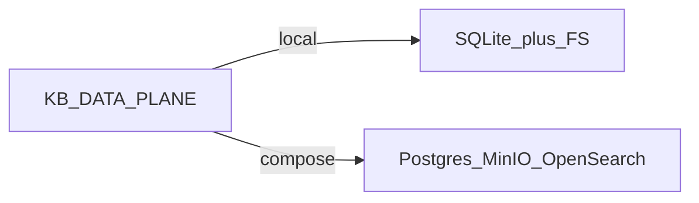

# Plan: Compose data plane + config selection

**Status:** Proposed (not started)  
**Related:** [docs/architecture-design.md](../docs/architecture-design.md) §2–§7, [SPEC-ingestion.md](../SPEC-ingestion.md), [SPEC-query.md](../SPEC-query.md), [SPEC-report.md](../SPEC-report.md), [infra/README.md](../infra/README.md)

## Intent

1. **Finish the compose stack in code** (Postgres/pgvector, MinIO, schema, wiring) so it is a real product path — not a half-gated stub.
2. **Select path via config** — do not force Postgres/MinIO when local is preferred.

| `KB_DATA_PLANE` | Knowledge / vectors | Raw objects | BM25 / hybrid |
|---|---|---|---|
| `local` (default) | SQLite | Local filesystem | In-process keyword + dense RRF |
| `compose` | **Postgres + pgvector** | **MinIO** | OpenSearch if `OPENSEARCH_URL` set; else keyword fallback on PG/text |

Compose Docker is how you run deps for `compose`; the **code** must be complete either way. Setting `KB_DATA_PLANE=compose` against a down Postgres/MinIO fails clearly.

---

## Architecture fidelity audit (why this plan exists)

### §2 infrastructure modules

| Architecture target | Status | Notes |
|---|---|---|
| `PostgresFilingRepository` | Missing as named class | Combined `PostgresKnowledgeStore` |
| `PgVectorStore` | Missing as named class | Same store writes `embeddings vector(1536)` |
| `OpenAIAdapter` | Partial | `OpenAIChatLLM` + `OpenAIEmbedder` |
| `AnthropicAdapter` | Not implemented | — |
| `LocalVLLMAdapter` | Not implemented | — |
| `KafkaProducer` / `Consumer` | Not implemented | No `infrastructure/messaging/` |
| MinIO object store | Class exists | Only wired when `KB_DATA_PLANE=compose`; default uses local FS |

### §7 data model

| Table | Schema today | Runtime writes |
|---|---|---|
| `companies` / `filings` / `chunks` / `embeddings` | Yes (`infra/initdb/02-ingestion.sql`) | Only when compose selected |
| `financial_facts` | No | No (XBRL deferred; empty table OK in this slice) |
| `reports` / `report_citations` | SQL artifact not in initdb | In-memory only |
| `query_logs` | No | No |

**Default today:** `KB_DATA_PLANE=local` → SQLite + FS. Postgres/MinIO only if compose is selected **and** deps are up.

---

## What already exists vs finish

| Piece | Today | Finish in this plan |
|---|---|---|
| `PostgresKnowledgeStore` | Yes | Split/alias → `PostgresFilingRepository` + `PgVectorStore` |
| `MinioObjectStore` | Yes | Used whenever plane=`compose` |
| BFF switch | Partial (`KB_DATA_PLANE`) | Unified; ingest + query + reports follow plane |
| §7 tables | Partial | Add `financial_facts`, `reports`, `report_citations`, `query_logs` |
| Report persist | In-memory always | **compose** → Postgres + MinIO; **local** → in-memory |
| `query_logs` | Missing | Write when compose |
| OpenSearch | Optional in compose builder | Keep optional; document |

---

## Implementation steps

### 1. Config surface

- Keep / clarify `KB_DATA_PLANE=local|compose` in `.env.example`, BFF `apps/bff/src/kb_bff/settings.py`, CLI `--backend`.
- Document that for `compose`, `DATABASE_URL` + `MINIO_*` are required; `OPENSEARCH_URL` recommended.
- `/healthz`: expose `data_plane` plus postgres / minio / opensearch readiness when compose.

### 2. Complete compose schema

- Extend `infra/initdb/` (e.g. `02-ingestion.sql` or `03-app.sql`) with full §7 leftovers.
- Optional migrate-on-connect in Postgres store so any Postgres (not only fresh Compose volumes) gets tables.

### 3. Compose wiring completeness

- Ingest: `build_compose_ingest` → Postgres + MinIO + OpenSearch index when URL set (`services/ingestion/.../wiring.py`).
- Query: `build_compose_answer_query` → pgvector dense + OpenSearch/keyword (`services/query/.../wiring.py`).
- BFF lifespan: `compose` wires ingest + query + **Postgres reports** + MinIO; `local` keeps SQLite/FS + in-memory reports.
- Fail fast with clear errors if compose selected but DB/MinIO unreachable.

### 4. Architecture names (compose persistence)

- Add `PostgresFilingRepository` + `PgVectorStore` (thin split or wrappers of `PostgresKnowledgeStore`); wire compose builders through them.

### 5. Docs

- Update `docs/architecture-design.md` §3: both paths selectable; compose implements object store + vector DB.
- Update ingest/query/infra READMEs: set `KB_DATA_PLANE=compose` after `docker compose up`.

---

## Checklist

- [ ] Full §7 schema in initdb + migrate-on-connect
- [ ] Compose ingest/query/report wiring complete (Postgres + MinIO + optional OpenSearch)
- [ ] `KB_DATA_PLANE=local|compose` documented and drives all three surfaces
- [ ] Compose: Postgres reports + MinIO artifacts + `query_logs`
- [ ] `PostgresFilingRepository` + `PgVectorStore` exposed
- [ ] Healthz + README/architecture updated

---

## Out of scope (this slice)

- Anthropic / vLLM adapters
- Kafka / Redis Streams messaging
- Docling / XBRL loaders (table may exist empty)
- Real OIDC JWKS
- True LLM token SSE
- Deleting the local path
- K8s / Helm

## Note on prior “always-on” discussion

Superseded: backends are **selectable via config**, with compose fully implemented. Local remains valid for offline/dev without Docker.

## Follow-ons (later plans)

- Docling + XBRL → `financial_facts`
- Cross-encoder rerank, true token SSE
- OIDC + SSO UI
- OTLP / Langfuse / Ragas CI
- Dagster live ETL; messaging ports
